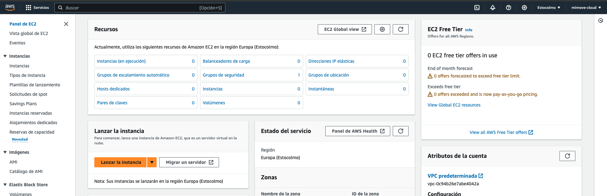
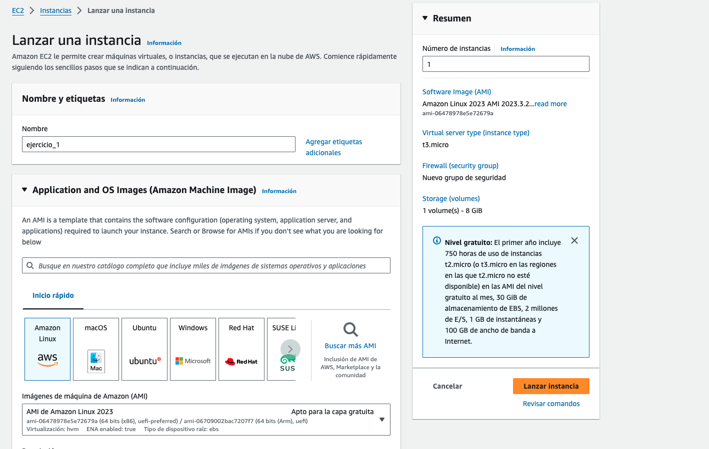
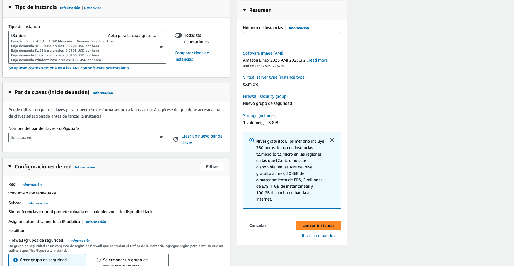
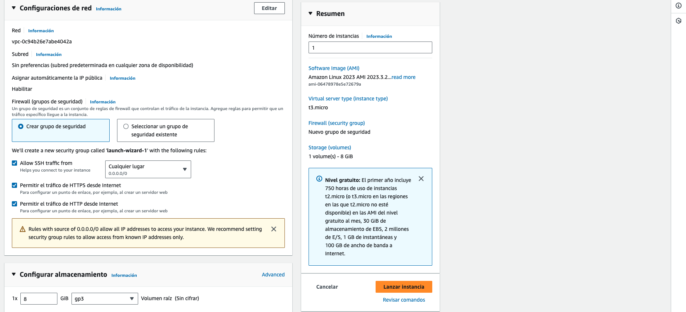
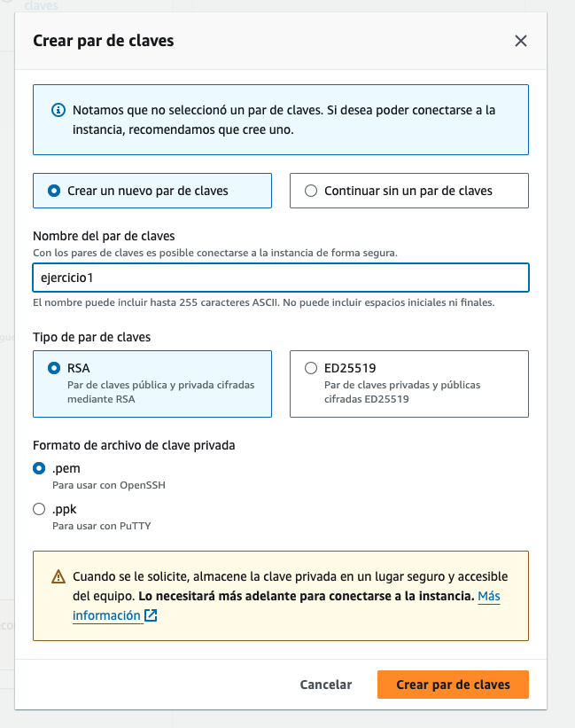
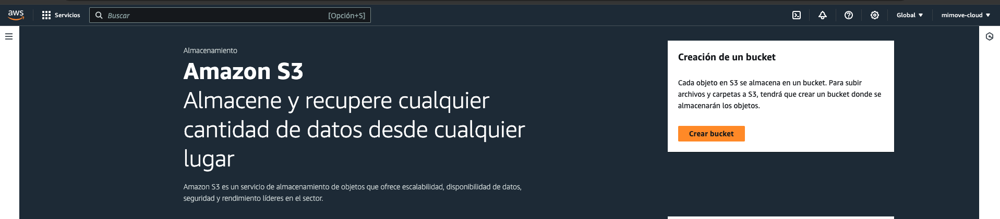
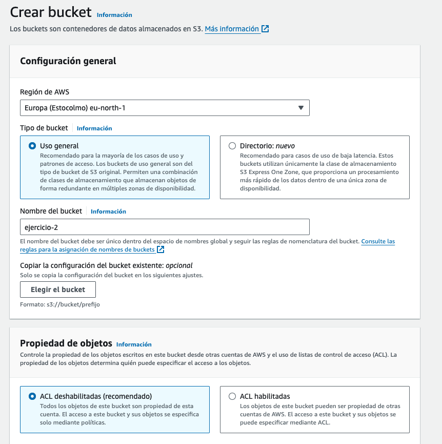
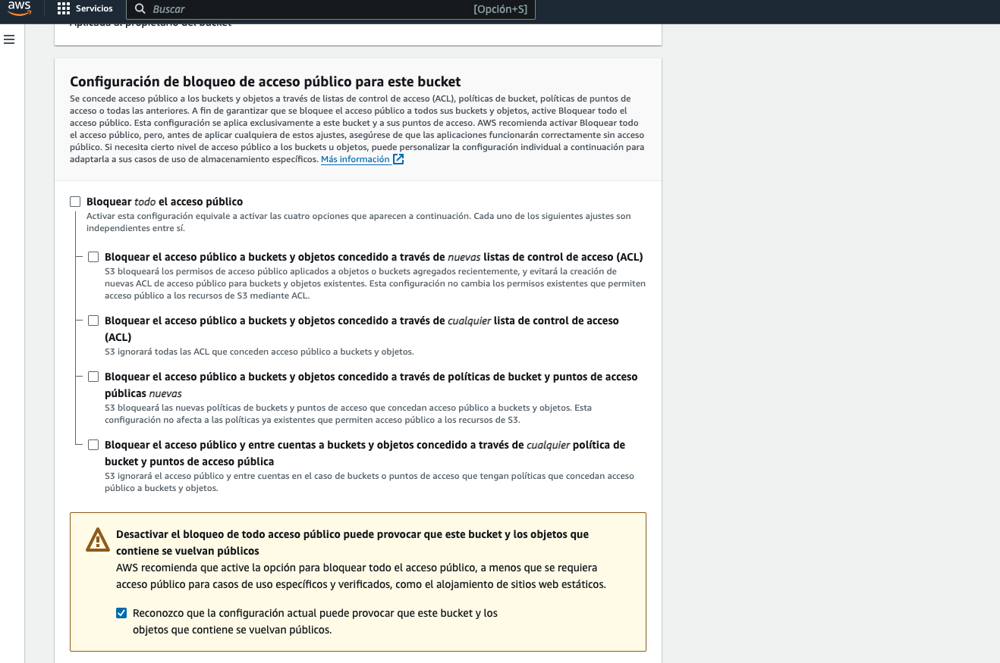

# AWS Cloud Computing Fundamentals

## 1. EC2 instance

### Introduction to EC2

Amazon Elastic Compute Cloud (Amazon EC2) is a web service that provides secure, resizable compute capacity in the cloud. It is designed to make web-scale cloud computing easier for developers. Amazon EC2’s simple web service interface allows you to obtain and configure capacity with minimal friction. It provides you with complete control of your computing resources and lets you run on Amazon’s proven computing environment.

To create and manage your virtual machines, you can use AWS CLI or the web UI. In this exercise, you will use first the web UI and then the CLI.

### Create an EC2 instance

1. In the AWS Console, go to the EC2 page.

2. Click on `Launch Instance`.

3. Configure the instance as follows selecting Ubuntu as the operating system:

4. Create a new key pair and give it the name `ejercicio1`. Download the key pair and save it in the folder `00_DocAux/AWS/01_EC2`.

5. Click on `Launch Instances`.

6. Once the instance is created, you can connect to it by clicking on `Connect` and following the instructions.

## 2. S3 Storage Bucket

### Introduction to S3

Amazon Simple Storage Service (Amazon S3) is an object storage service that offers industry-leading scalability, data availability, security, and performance. This means customers of all sizes and industries can use it to store and protect any amount of data for a range of use cases, such as data lakes, websites, mobile applications, backup and restore, archive, enterprise applications, IoT devices, and big data analytics. Amazon S3 provides easy-to-use management features so you can organize your data and configure finely-tuned access controls to meet your specific business, organizational, and compliance requirements. Amazon S3 is designed for 99.999999999% (11 9's) of durability, and stores data for millions of applications for companies all around the world.

### Create a bucket

1. In the AWS Console, go to the S3 page.
   

2. Click on `Create bucket`. And apply the following configuration:
   
   

3. Leave the rest of the options as default and click on `Create bucket`.
