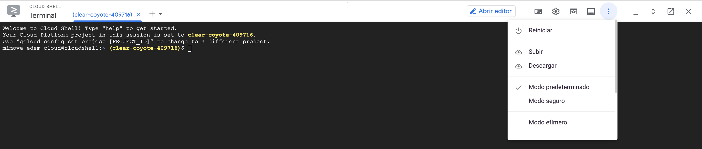
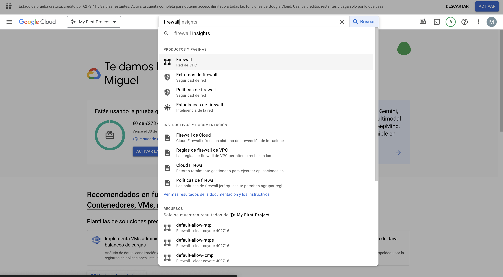
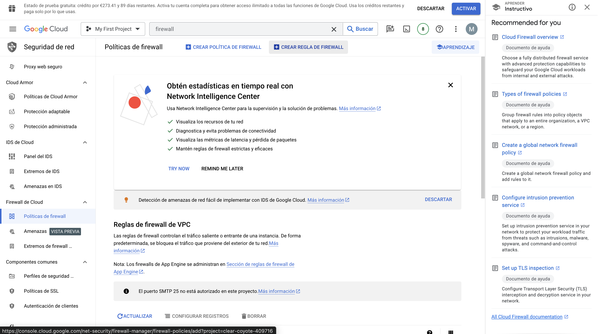
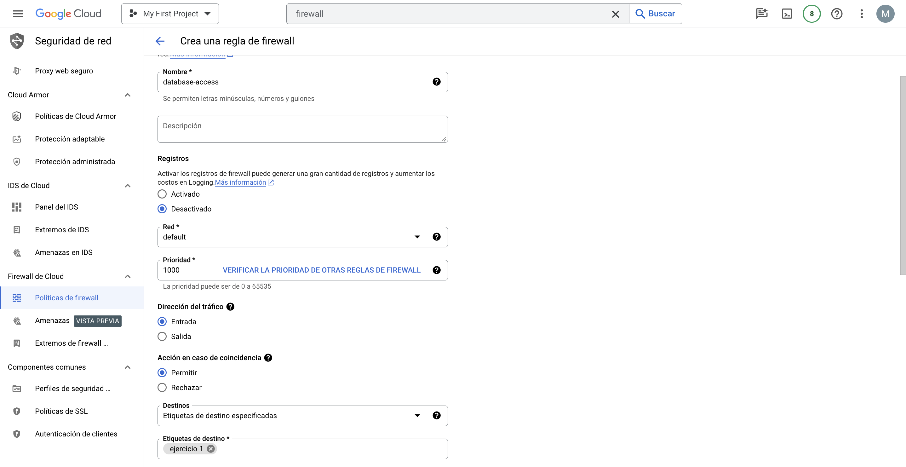
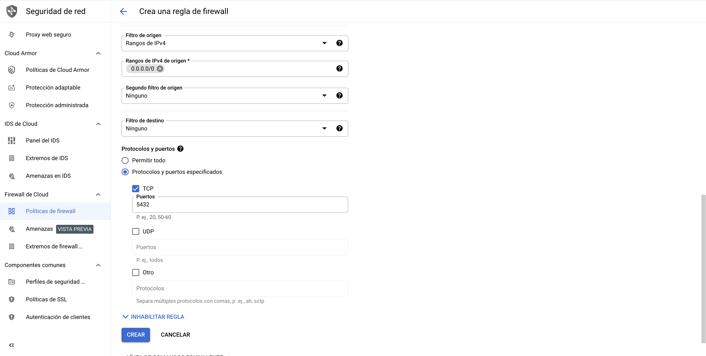
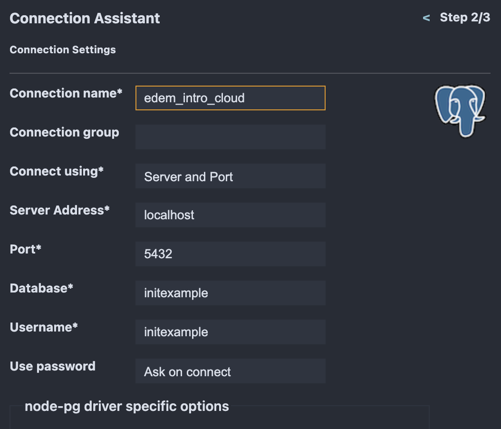
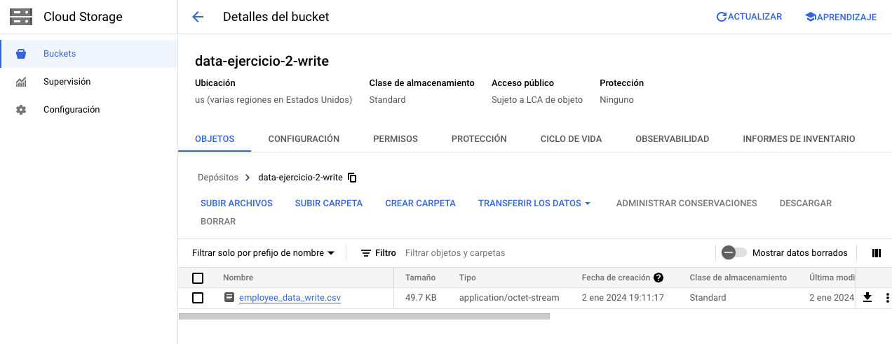
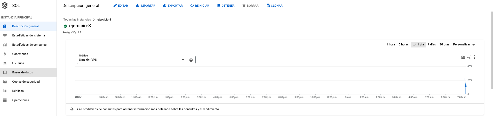
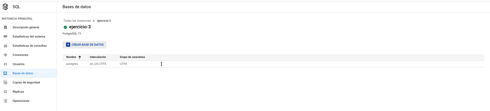
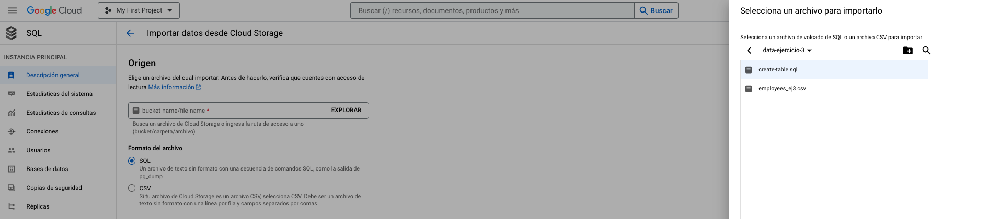

# Cloud computing fundamentals excercises

## 1. Virtual machines

1. Create a VM following the instructions in the [README.md](/00_DocAux/GCP/README.md) file.

2. Install Docker by following the steps of this link: https://tomroth.com.au/gcp-docker/
   
3. Once docker is installed, upload the folder `01_Code/01_Fundamentals/GCP/01_VM` to the VM.
   

4. Run `docker compose up -d` from the `01_Code/01_Fundamentals/GCP/01_VM` folder. This will create a postgres database, run the init.sql script creating a table and inserting some data from a csv file.
   
5. Once the database is created, you can try to access the container by running `docker exec -it <container_id> psql -U initexample` and then `select * from employees_data limit 10;` This will show you 10 files of the table created.
   
6. However, if want to access it from your local machine, you need to create a firewall rule to allow the connection. To do so, go to the VPC network section in the GCP console and create a new firewall rule. To do so, follow these steps:
    6.1 Go to the VPC network section in the GCP console and create a new firewall rule.
    
    
    6.2 Create a new firewall rule with the following parameters:
    
    

7. Try to query the database from the VM. You can install the following vscode extension to do so https://marketplace.visualstudio.com/items?itemName=mtxr.sqltools-driver-mysql

8. From there, you can connect to the database using the following credentials:
   - Host: \<VM external IP\>
   - Port: 5432
   - User: initexample
   - Password: initexample
   - Database: initexample
    

9. Once everything is set up, you can try to run the following query to check that everything is working properly:
   ```sql
   select * from employees_data limit 10;
   ```

<br>

## 2. Cloud Storage

### 2.1. Read from a bucket

   1. Create a bucket following the instructions in the [README.md](/00_DocAux/GCP/README.md) file.

   2. Upload the content of the folder `01_Code/01_Fundamentals/GCP/02_GCS` to `Cloud Shell`.

   3. Run the command to install the requirements: `pip install -r requirements.txt`

   4. Run the command to read the file from the bucket: `python read_from_bucket.py`

   5. You should get something like this:
   

| id | first_name | last_name | email | salary |
| --- | --- | --- | --- | --- |
| 1 | Alidia | Found |  afound0@who.int | 37061.15 |
| 2 | Carmelita | Kainz | ckainz1@facebook.com | 56282.20 |
| 3 | Tam | Pigford | pigford2@miitbeian.gov.cn | 42217.15 |
| 4 | Malinde | Turbern | mturbern3@springer.com | 42057.87 |
| 5 | Starla | Laffling |  slaffling4@addtoany.com | 33477.31 |


### 2.2. Write to a bucket

   1. Run the command to write the file to the bucket: `python write_to_bucket.py`

   2. Go to the bucket `data-ejercicio-2` and check that the file has been uploaded correctly.



<br>

## 3. Cloud SQL
   
1. Create a PostgreSQL instance following the instructions in the [README.md](/00_DocAux/GCP/README.md) file.

2. Go to the SQL page in the GCP console and click on the instance you just created.
   
3. Select Database tab on the left menu and click on the `Create database` button.
   



4. Give the name `initexample` to the database and click on `Create`.


5. Create a bucket following the instructions in the [README.md](/00_DocAux/GCP/README.md) file. Give the name `ejericio-3` to the bucket.

6. Upload the files `create-table.sql` and `employee_ej3.csv` from the folder `01_Code/01_Fundamentals/GCP/03_CloudSQL` to the bucket `ejericio-3`.

7. Click on the `Import` button and select the file from the bucket `data-ejercicio-3/create-table.sql`.



8. Once the table is created, click on the `Import` button again and select the file from the bucket `data-ejercicio-3/employee_ej3.csv`.


9. Once the file is imported, you can check that the data has been inserted correctly by running the python script called `check-data.py` from the folder `01_Code/01_Fundamentals/GCP/03_CloudSQL`.

You should get something like this:

```txt
(1, 'Jody', 'Pollok', 'jpollok0@altervista.org', Decimal('90327.98'))
(2, 'Waring', 'Alen', 'walen1@youku.com', Decimal('81314.22'))
(3, 'Ev', 'Dobrowolny', 'edobrowolny2@usnews.com', Decimal('53530.16'))
(4, 'Hulda', 'Bloore', 'hbloore3@weather.com', Decimal('26500.46'))
(5, 'Pasquale', 'Mouland', 'pmouland4@elpais.com', Decimal('31010.02'))
(6, 'Claus', 'Dudderidge', 'cdudderidge5@oakley.com', Decimal('99368.53'))
(7, 'Lamond', 'Wagenen', 'lwagenen6@statcounter.com', Decimal('10800.08'))
(8, 'Jeanelle', 'Rumney', 'jrumney7@weebly.com', Decimal('63055.47'))
(9, 'Ddene', 'Fielden', 'dfielden8@who.int', Decimal('89232.40'))
(10, 'Cathryn', 'Dowdell', 'cdowdell9@pinterest.com', Decimal('82845.69'))
```


10. Furthermore, you can also insert new data from a different csv by running the file `insert-data.py` from the folder `01_Code/01_Fundamentals/GCP/03_CloudSQL`. This will insert the data from the file `employee_ej3_python.csv` into the table `employees_data`.


<br>

## 4. Cloud Run

1. First, we will run the Flask API code locally to check what we want to achieve. To do so, go to the folder `01_Code/01_Fundamentals/GCP/04_CloudRun` and run the following command: `python app.py`. This will start a local server in your machine.

2. In a browser of your choice, go to the following url: `http://localhost:5000/employees`. You should get something like this:

```json
[
  {
    "email": "geoffrey22@example.org",
    "first_name": "Teresa",
    "id": 808,
    "last_name": "Torres",
    "salary": 37525.01
  },
  {
    "email": "garciajulie@example.com",
    "first_name": "Crystal",
    "id": 590,
    "last_name": "Hunter",
    "salary": 39075.47
  },

  --- More data ---

    {
    "email": "washingtondebra@example.net",
    "first_name": "Charles",
    "id": 346,
    "last_name": "Sherman",
    "salary": 77096.99
  },
  {
    "email": "hcolon@example.net",
    "first_name": "Margaret",
    "id": 429,
    "last_name": "Davis",
    "salary": 58775.39
  }
]

```

3. Now, we can create the docker image locally and run the container in our machine to check that everything is working properly. To do so, run the following commands:

```bash
docker build -t my-python-api .
docker run -p 5000:5000 my-python-api
```
4. We can also post data to the API by running the following script:

```bash
python post_employees.py
```

5. Now, we will build the image directly in the GCP Container Registry. To do so, upload the folder `01_Code/01_Fundamentals/GCP/04_CloudRun` to the `Cloud Shell` and run the following command inside that folder:

```bash
gcloud builds submit --tag gcr.io/<project-id>/my-python-api
```

6. Once the image is built, we can deploy it to Cloud Run. To do so, we follow the steps explained in the [README.md](/00_DocAux/GCP/README.md) file.


