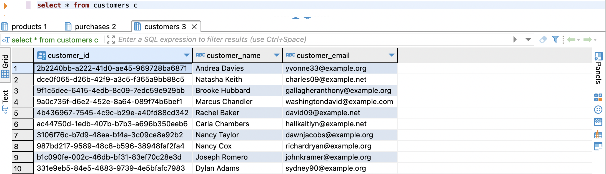
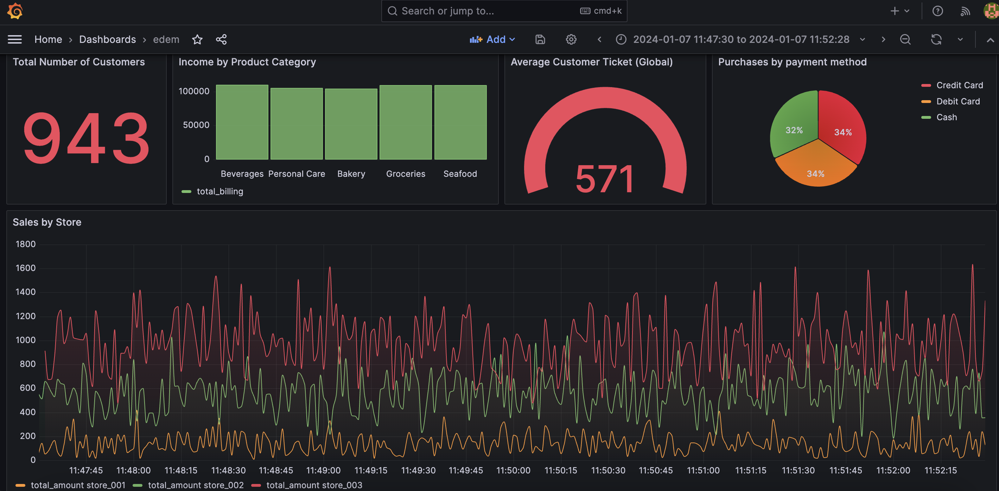

# Cloud Computing EDEM 2024 
Cloud Computing Architectures | EDEM 2024

- Weekday Group Professor: [Miguel Moratilla](https://github.com/mimove)
- Weekend Group Professor: [Javi Briones](https://github.com/jabrio)

## **00** Setup Requirements

**GCP**
- [Google Cloud Platform - Free trial](https://console.cloud.google.com/freetrial)
- [Install Cloud SDK](https://cloud.google.com/sdk/docs/install)

**AWS**
- [Amazon Web Services - Free trial](https://aws.amazon.com/free)
- [Install AWS CLI](https://aws.amazon.com/cli)
  
## **01** Cloud Computing: Fundamentals

### Google Cloud Platform (GCP) components set-up. [Link](00_DocAux/GCP/README.md)

<br>

### Google Cloud Platform (GCP) excercises. [Link](01_Code/01_Fundamentals/GCP/README.md)

#### Exercise 01: VM. [Link](01_Code/01_Fundamentals/GCP/01_VM)
#### Exercise 02: Cloud Storage. [Link](01_Code/01_Fundamentals/GCP/02_GCS)
#### Exercise 03: Cloud SQL. [Link](01_Code/01_Fundamentals/GCP/03_DB)
#### \*\* Extra \*\* Exercise 04: Cloud Run. [Link](01_Code/01_Fundamentals/GCP/04_CR')

<br>

### Amazon Web Services (AWS) components set-up. [Link](00_DocAux/AWS/README.md)

<br>

### Amazon Web Services (AWS) excercises. [Link](01_Code/01_Fundamentals/AWS/README.md)

#### Exercise 01: EC2. [Link](01_Code/01_Fundamentals/AWS/01_VM)
#### Exercise 02: S3. [Link](01_Code/01_Fundamentals/AWS/02_S3)
#### Exercise 03: RDS. [Link](01_Code/01_Fundamentals/AWS/03_RDS)


## **02** Cloud Computing: Event-Driven Architecture

#### Case description


As members of the Data team at Whole Foods Market, we have been assigned the task of developing a dashboard to monitor purchases made in three of our grocery stores.

#### Case Requirements

- Each grocery store, operating with its own internal processes, will provide transactional data to be stored in our object storage. Therefore, it is required that each grocery store's internal processes have the **necessary permissions** to execute this action.

- Implement an **event-driven architecture**, ensuring that data is immediately stored in the respective tables. The solution should be **optimized** in terms of resource utilization and cost-effectiveness.

- Given the familiarity of our Data team with **Postgres** as a Database, it is the preferred choice for this project.

- The final dashboard should be **exposed as a service** to allow different teams access.

#### Data Architecture


#### Deployment instructions
The exercise will be carried out in pairs in two different GCP projects to work on permission granting.

## Setup

1. Clone this **repo**, either using Cloud Shell or locally (in both projects).

2. Verify that you have already enabled the required *Google Cloud APIs* by running the following commands:

- Project 01

```
gcloud services enable compute.googleapis.com
```

- Project 02

```
gcloud services enable sql-component.googleapis.com
gcloud services enable cloudfunctions.googleapis.com
gcloud services enable secretmanager.googleapis.com
gcloud services enable cloudbuild.googleapis.com
gcloud services enable sqladmin.googleapis.com
gcloud services enable eventarc.googleapis.com
gcloud services enable storage.googleapis.com
gcloud services enable pubsub.googleapis.com
gcloud services enable run.googleapis.com
```

## Project 01 

1. Before creating the different VMs, we will create a specific [service account](https://console.cloud.google.com/iam-admin/serviceaccounts) for this purpose. We need to grant the necessary permissions to this service account so VMs can store data into the bucket located in the other project.

2. **Edit the startup script** with your username. Find it in the first part of the email that appears in the Cloud Shell.

3. Run the following command as many times as VMs you want to create, changing only the name of each one:

```
gcloud compute instances create <YOUR_INSTANCE_NAME> \
    --image-project=debian-cloud \
    --image-family=debian-11 \
    --machine-type n1-standard-1 \
    --service-account=<YOUR_SERVICE_ACCOUNT_EMAIL> \
    --scopes cloud-platform \
    --metadata-from-file=startup-script=<LOCAL_PATH_TO_YOUR_STARTUP_SCRIPT>
```

## Project 02

1. Go to the Google [Cloud Storage Console](https://console.cloud.google.com/storage) and create a bucket. This bucket must have a **globally unique name** and be **regional**. It will serve as a landing zone for data generated by the VMs in the other project and for the function that listens for events to run its logic.

2. Go to the [IAM Console](https://console.cloud.google.com/iam-admin/iam) and click on *Grant access*. Add the email of the service account created in the other project. We will assign the *Storage Admin* role only to the bucket we just created.

3. Go to the [Cloud SQL Console](https://console.cloud.google.com/sql) 

 - Create a Postgres Database or use the one previously created.

 - Create the required tables from the provided SQL file:

    - **Cloud Console** + **Cloud shell**:

        - Upload the [SQL file](01_Code/02_Event_Driven_Architecture/03_SQL) from our repo to your Cloud Storage Bucket.
        - Import the SQL file using the Cloud SQL Console.
        - Connect to the Cloud SQL Instance from the Cloud Shell and visualize the tables.

    - **Dbeaver** or any other database admin tool using the [Cloud SQL Proxy](https://cloud.google.com/sql/docs/postgres/connect-auth-proxy)

4. After creating the database username and password, go to the [Secret Manager](https://console.cloud.google.com/security/secret-manager) to create the secrets. These variables will be used later to deploy the Cloud Function.

5. Go to the [Cloud Function](https://console.cloud.google.com/functions/) console and create a function with the following specifications:

- Environment: 2nd gen.

- Region: <YOUR_REGION_ID>

- Trigger Type: **Cloud Storage**.

- Event Type: **google.cloud.storage.object.v1.finalized**.

- Bucket: <YOUR_BUCKET_NAME>

- In the *Runtime* tab, Add Runtime Variables:
    - PG_INSTANCE_URL: <YOUR_INSTANCE_CONNECTION_NAME> 
    - PG_DB: <YOUR_DATABASE_NAME>
    - PROJECT_ID: <YOUR_PROJECT_ID>

- In the *Security and Image repo* tab,Add secrets as environment variables pointing to the previously created secrets.
    - DB_USER: <YOUR_DATABASE_USER_SECRET>
    - DB_PASSWORD: <YOUR_DATABASE_PASSWORD_SECRET>

- Grant permissions to the default service account for the requested resources.
- Click on Next.

- Select **Python 3.10** as Runtime.

- Upload the Cloud Function Source Code in zip format or add them one by one from the console. [Source Code](01_Code/02_Event_Driven_Architecture/02_CloudFunction).

- Enter *store_data_into_cloud_sql* as the entry_point for the function.

- After deploying the Cloud Function, navigate to the Cloud Run service that is generated linked to it. Click on **Edit and deploy new revision**, scroll down to the **Cloud SQL connections section**, add our previously created Cloud SQL instance, and click on deploy.

6. Go back to the Cloud Shell and navigate to the [Cloud Run](01_Code/02_Event_Driven_Architecture/04_CloudRun) folder. Now, we are going to deploy a Cloud Run service with the Docker image of Grafana.

- Build the Docker Image.

```
docker build -t grafana-cloud-run .
```

- Go to the [Artifact Registry Console](https://console.cloud.google.com/artifacts) and create a repository with the default values.

- Tag the Docker Image.

```
docker tag grafana-cloud-run <REGION_ID>-docker.pkg.dev/<PROJECT_ID>/<ARTIFACT_REPOSITORY>/grafana-cloud-run:<TAG>
```

- Push the image to Artifact Registry.

```
docker push grafana-cloud-run <REGION_ID>-docker.pkg.dev/<PROJECT_ID>/<ARTIFACT_REPOSITORY>/grafana-cloud-run:<TAG>
```

7. Go to the [Cloud Run Console](https://console.cloud.google.com/run) and click on **Create Service**:

- Select the Docker image that we just pushed to Artifact Registry.
- Click on **Allow unauthenticated invocation**. 
- Set port **3000** as the container port.
- There is no need to add the environment variables and secrets at this step, as we can do it directly from the Grafana UI.
- In **Cloud SQL connections**, add the instance we just created
- Click on **Create**.

8. Go back to the **Project 01** and run the **Generator.py** for each grocery store and check that all the data has been loaded correctly in the database.

```
gcloud compute ssh <GCE_INSTANCE_NAME> --command="python3 generator.py --project_id <YOUR_PROJECT_ID> --bucket_name <YOUR_BUCKET_NAME> --store_id <YOUR_GROCERY_STORE_ID>"
```



9. After the Cloud Run service has been deployed, go to the **URL that the service has created**. This URL will take you to the Grafana UI.

- Click on **Data Sources**.
- Select **PostgreSQL**.
- Enter the connection settings and establish the connection with the database:

    - Host URL: Ensure that it is declared with the following syntax: /cloudsql/<YOUR_CLOUD_SQL_INSTANCE_CONNECTION_NAME>. More info: https://cloud.google.com/sql/docs/postgres/connect-run

    - Database name: <YOUR_DATABASE_NAME>

    - Username: <YOUR_DATABASE_USER>

    - Password: <YOUR_DATABASE_PASSWORD>

    - TLS/SSL Mode: disabled

    - PostgreSQL Version: <YOUR_CLOUD_SQL_INSTANCE_VERSION>

- Once the connection is created, go to the dashboard tab to create charts that best represent business metrics using SQL



10. Clean Up

- Remove the VMs created:

```
gcloud compute instances delete <YOUR_INSTANCE_NAME>
```

- Remove your Cloud SQL Instance

```
gcloud sql instances delete <YOUR_CLOUD_SQL_INSTANCE_NAME>
```

- Remove your Cloud Function

```
gcloud functions delete <YOUR_CLOUD_FUNCTION_NAME> --region <YOUR_REGION_ID>
```

- Remove your Cloud Run Service

```
gcloud run services delete <YOUR_CLOUR_RUN_SERVICE_NAME> --platform=managed --region=<YOUR_REGION_ID>
```

- Remove your Google Cloud Storage Bucket

```
gcloud storage buckets delete <YOUR_GCS_BUCKET_NAME>
```

## **03** Extra Exercise (Homework Assignment)

As an exercise, you are required to reproduce the **whole architecture**, specifying each step of the solution and providing screenshots for each. Additionally, you should create a Grafana dashboard that explains the variables you want to highlight.

## **04** Bibliography & Additional Resources (GCP)

- IAM
    - https://cloud.google.com/iam/docs/service-accounts-create
    - https://cloud.google.com/iam/docs/understanding-roles

- VM
    - https://cloud.google.com/compute/docs/instances/create-start-instance 

- Cloud SQL
    - https://cloud.google.com/sql/docs/postgres/create-instance
    - https://cloud.google.com/sql/docs/postgres/connect-auth-proxy

- Cloud Functions
    - https://cloud.google.com/functions/docs/console-quickstart

- Artifact Registry
    - https://cloud.google.com/artifact-registry/docs/repositories/create-repos

- Cloud Run
    - https://cloud.google.com/run/docs/deploying
    - https://cloud.google.com/sql/docs/postgres/connect-run
